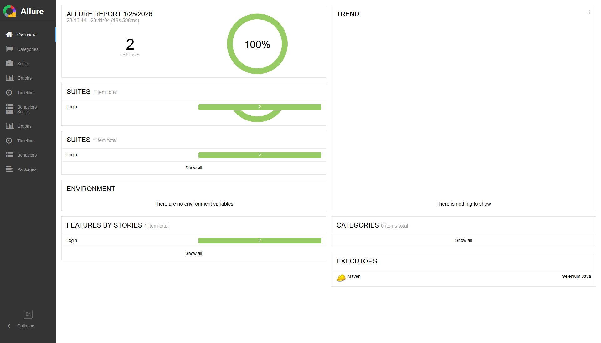

# Selenium Java Automation Framework

[](https://www.oracle.com/java/)
[](https://www.selenium.dev/)
[](https://cucumber.io/)
[](https://docs.qameta.io/allure/)

<p align="center">
  <a href="https://bout-gabouz-lemasle.github.io/Selenium-Java-Framework/allure-report/index.html">
    
  </a>

  <a href="https://bout-gabouz-lemasle.github.io/Selenium-Java-Framework/cucumber-html-reports/overview-features.html">
    
  </a>
</p>

---

<p align="center">
<a href="#-english">🇬🇧 English</a> | <a href="#-français">🇫🇷 Français</a>
</p>

---

<a name="english"></a>
## 🇺🇸 English

### 📖 Introduction
This is a **robust** and **parallel** Test Automation Framework (Work-in-Progress) designed for testing web applications (currently implementing scenarios for Swag Labs).
While the core architecture (based on Selenium WebDriver, Java, Cucumber, and TestNG) is fully functional and optimized for **parallel execution**, I am actively working on expanding the test suite and adding DevOps capabilities.

### ✨ Key Features
* **Page Object Model (POM):** Clean separation between test logic and page elements.
* **Parallel Execution:** Thread-safe execution using `ThreadLocal`, allowing multiple tests to run simultaneously.
* **BDD Approach:** Tests written in Gherkin syntax (`.feature` files).
* **Rich Reporting:**
    * **Allure Reports:** Interactive reports with screenshots, logs, and graphs.
    * **Cucumber HTML:** Classic reporting available in the `reports/` folder.
* **Automatic Debugging:** Captures Screenshots, Console Logs (JS), and Network Traffic automatically upon test failure.

### 🛠 Tech Stack
* **Language:** Java 21
* **Web Automation:** Selenium WebDriver 4
* **BDD Framework:** Cucumber 7
* **Test Runner:** TestNG
* **Build Tool:** Maven
* **Reporting:** Allure & Maven Cucumber Reporting

### 🚀 Getting Started

#### Prerequisites
* Java JDK 21+ installed and configured in `JAVA_HOME`.
* Maven 3.x installed and configured in `PATH`.
* Google Chrome (or Firefox) installed.

#### Installation
Clone the repository:
```bash
git clone [https://github.com/YOUR_USERNAME/Selenium-Java-Framework.git](https://github.com/YOUR_USERNAME/Selenium-Java-Framework.git)
cd Selenium-Java-Framework
```
### ⚙️ Configuration
The framework is driven by property files located in src/main/resources:
* **config.properties:** Global settings (URL, etc.).
* **accounts.properties:** User credentials.

### 🏃‍♂️ Running Tests
#### Default Run
Executes all tests using the default browser (Chrome):
```bash
mvn clean verify
```
#### Custom Run (Options)
You can override properties via command line:
```bash
# Run on Firefox in Headless mode with 4 parallel threads
mvn clean verify -Dbrowser=firefox -Dheadless=true -Dthread=4
```

### 📊 Reporting
#### 1. Allure Report (Recommended)
To view the detailed interactive report, run this command after the tests:
```bash
mvn allure:serve
```
**Note:** This will open a web server displaying the results.

#### 2. Static HTML Reports
You can find static reports generated in:
* `reports/cucumber-html-reports/overview-features.html`
* `reports/cucumber-html/cucumber.html`

#### 3. Reporting Sample
Here is an example of the generated Allure Report dashboard:



<a name="français"></a>
## 🇫🇷 Français

### 📖 Introduction
Ceci est un framework d'automatisation de tests **robuste** et **parallèle** (en cours de développement), conçu pour les applications web (actuellement sur Swag Labs).
Bien que l'architecture centrale (basée sur Selenium WebDriver, Java, Cucumber et TestNG) soit totalement fonctionnelle et optimisée pour l'**exécution parallèle**, je travaille activement à l'extension de la suite de tests et à l'ajout de capacités DevOps.

### ✨ Fonctionnalités Clés
* **Page Object Model (POM):** Séparation claire entre la logique de test et les éléments de page.
* **Exécution Parallèle:** Exécution "Thread-safe" via `ThreadLocal`, permettant de lancer plusieurs scénarios simultanément.
* **Approche BDD:** Tests écrits en syntaxe Gherkin (fichiers `.feature``).
* **Rapports Détaillés:**
    * **Allure Reports:** Rapports interactifs avec captures d'écran, logs et graphiques.
    * **Cucumber HTML:** Rapports classiques disponibles dans le dossier `reports/`.
* **Débogage Automatique:** Capture automatiquement une capture d'écran, les logs console (JS) et le trafic réseau en cas d'échec.

### 🛠 Stack Technique
* **Langage:** Java 21
* **Automatisation Web:** Selenium WebDriver 4
* **Framework BDD:** Cucumber 7
* **Runner de Test:** TestNG
* **Outil de Build:** Maven
* **Reporting:** Allure & Maven Cucumber Reporting

### 🚀 Pour Commencer
#### Prérequis
* Java JDK 21+ installé et configuré dans `JAVA_HOME`.
* Maven 3.x installé et configuré dans le `PATH`.
* Google Chrome (ou Firefox) installé.

#### Installation
Clonez le dépôt :
```bash
git clone [https://github.com/VOTRE_NOM_UTILISATEUR/Selenium-Java-Framework.git](https://github.com/VOTRE_NOM_UTILISATEUR/Selenium-Java-Framework.git)
cd Selenium-Java-Framework
```

### ⚙️ Configuration
Le framework est piloté par des fichiers de propriétés situés dans src/main/resources :
* **config.properties:** Paramètres globaux (URL, etc.).
* **accounts.properties:** Identifiants des utilisateurs.

### 🏃‍♂️ Lancer les Tests
#### Lancement par défaut
Exécute tous les tests en utilisant le navigateur par défaut (Chrome) :
```bash
mvn clean verify
```

#### Lancement Personnalisé (Options)
Vous pouvez surcharger les propriétés via la ligne de commande :
```bash
# Lancer sur Firefox en mode sans tête (headless) avec 4 threads parallèles
mvn clean verify -Dbrowser=firefox -Dheadless=true -Dthread=4
```
### 📊 Rapports
#### 1. Rapport Allure (Recommandé)
Pour voir le rapport interactif détaillé, lancez cette commande après les tests :
```bash
mvn allure:serve
```
**Note:** Cela ouvrira un serveur web affichant les résultats.

#### 2. Rapports HTML Statiques
Vous trouverez les rapports statiques générés dans :
* `reports/cucumber-html-reports/overview-features.html`
* `reports/cucumber-html/cucumber.html`
* 
#### 3. Exemple de Rapport
Voici un exemple du tableau de bord généré par Allure Report :

